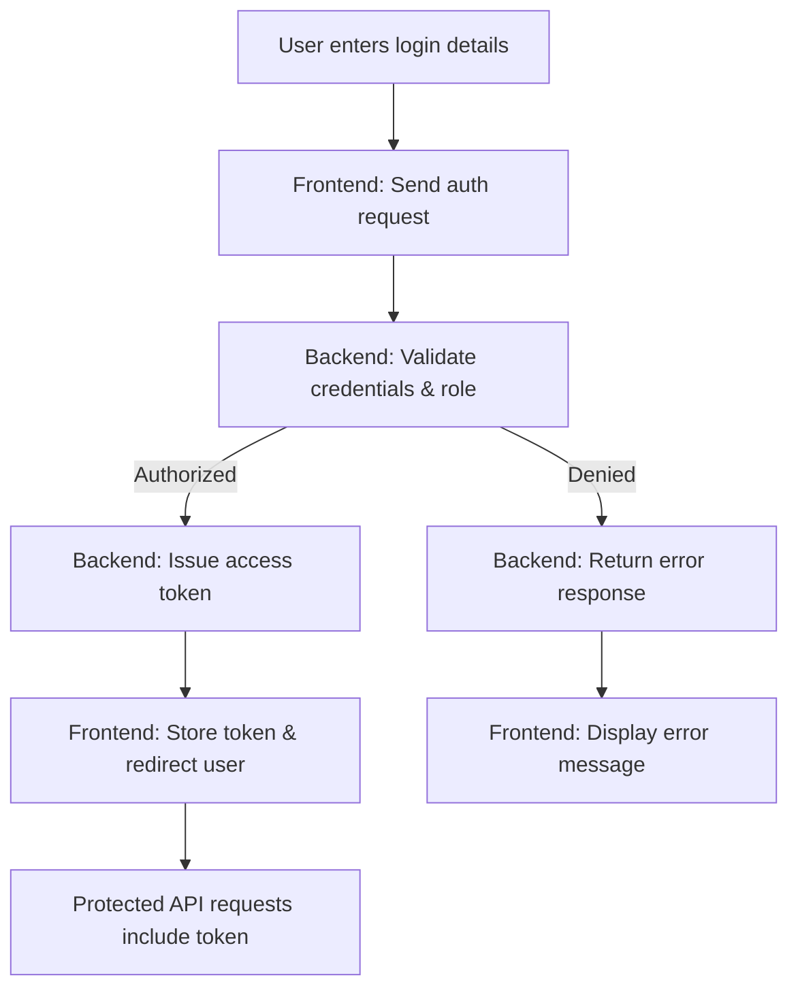

# 🚀 What Is UniFlux? (Mission & Vision)

UniFlux is an open-source, smart university management platform designed to simplify and optimize academic operations in modern institutions. It focuses on intelligent timetable generation, faculty workload balancing, and centralized academic management. Built with a real-world frontend and backend architecture, UniFlux follows a contributor-first approach, enabling developers to **understand the system, not just install it**, while collaboratively building a scalable and impactful solution.

---

## 📖 Table of Contents

1. [Why UniFlux?](#1-why-uniflux-problems-it-solves)
2. [High-Level System Map](#2-high-level-system-map)
3. [Folder Structure (What & Why)](#3-folder-structure-what--why)
4. [Architecture Deep Dive](#4-architecture-deep-dive)
5. [Core Features Explained](#5-core-features-explained)
6. [Frontend: The Client App](#6-frontend-the-client-app)
7. [Backend: The Server API](#7-backend-the-server-api)
8. [How to Run & Debug UniFlux](#8-how-to-run--debug-uniflux)
9. [Real Contributor Workflows](#9-real-contributor-workflows)
10. [Best Practices & Style Guide](#10-best-practices--style-guide)
11. [Learning Path: Beginner ➜ Contributor](#11-learning-path-beginner--contributor)
12. [Contributor Quick Wins](#12-contributor-quick-wins)
13. [How to Get Your PR Reviewed Faster](#13-how-to-get-your-pr-reviewed-faster)
14. [FAQ, Troubleshooting & Help](#14-faq-troubleshooting--help)
15. [Learning Resources & References](#15-learning-resources--references)

---

## 1. Why UniFlux? (Problems It Solves)

- **For Universities:** Eliminates manual timetable creation, reduces class clashes, balances faculty workload, and improves classroom and lab utilization.
- **For Faculty & Admins:** Simplifies academic planning with role-based access, clear workflows, and intelligent scheduling support.
- **For Contributors:** Real-world, domain-driven open-source project with clear structure, beginner-friendly issues, and strong documentation.
- **For Everyone:** Modern web stack with a “learn while building” philosophy focused on scalable, real-life systems.

---

## 2. High-Level System Map

```

UniFlux/
├── .github/ # GitHub templates (PRs, issues)
├── docs/ # Project docs: FAQ, INSTALL, ROADMAP, ENV
├── frontend/ # Frontend app (TypeScript / JavaScript / Tailwind)
├── backend/ # Backend API & core logic
├── README.md
├── CONTRIBUTING.md
├── CODE_OF_CONDUCT.md
├── ROADMAP.md
└── LICENSE

```

- **Mono-repo:** Frontend and backend maintained together for smooth collaboration
- **Docs-first:** Clear documentation to help contributors understand the system before coding

---

## 3. Folder Structure (What & Why)

**Top-level:**

- `.github/` → Issue and PR templates, workflow standards
- `docs/` → Project documentation (INSTALL, FAQ, ROADMAP, ENV)
- `frontend/` → All frontend logic, UI components, assets, and configs
- `backend/` → Backend APIs, authentication, core business logic
- `README.md` → Project overview and quick start guide
- `CONTRIBUTING.md` → Step-by-step contribution guidelines
- `LICENSE`, `CODE_OF_CONDUCT.md` → Legal terms and community rules

**Pro tip:** If you’re new, start with `README.md`, then check `docs/INSTALL.md` to set up the project locally.

---

## 4. Architectural Deep Dive (How Everything Connects)

- **Frontend (`frontend/`):** Built with TypeScript and JavaScript, styled using Tailwind CSS. Handles UI rendering, routing, form validation, and communicates with the backend via APIs.
- **Backend (`backend/`):** Manages authentication, role-based access, academic data, timetable logic, and result processing through secure REST APIs.
- **Shared Contract:** Environment variables, API endpoints, and request/response formats ensure smooth frontend–backend communication.

**Data flow example:**

1. User logs in from the frontend
2. Frontend sends authentication request to backend
3. Backend validates credentials and role permissions
4. Backend returns an access token or session
5. Frontend stores the token securely
6. Subsequent requests use the token to access protected academic resources

**Deployment:** Designed for cloud-based hosting with separate frontend and backend deployments for scalability and reliability.

---

## 5. Core Features Explained (With Flowcharts)

### 🔐 Authentication & Role Access Flow



### 🧠 Key Platform Features

- **Role-Based Dashboards:**
  Admin, Department Admin, and Faculty dashboards load data dynamically from the backend.

- **Smart Timetable Management:**
  Interfaces to define subjects, faculty availability, classrooms, and time slots.

- **Conflict Detection & Validation:**
  Identifies clashes in schedules and highlights them in real time.

- **Academic Data Handling:**
  Secure retrieval and display of timetable and result-related data.

- **Error Handling & Feedback:**
  Backend returns structured status codes; frontend displays meaningful messages.

**See code:**
For implementation details, explore the `frontend/` components and `backend/` API routes.

---

## 6. Frontend: The Client App

- **Stack:** TypeScript, JavaScript (ES6+), Tailwind CSS
- **Build Tool:** Vite for fast development and hot reload
- **Configs:** `vite.config.ts`, `tailwind.config.js`, `tsconfig.json`, `.env`
- **Main Areas:** Reusable components, role-based pages, routing, and utility helpers (inside `src/`)

**Development workflow:**

- `npm install`
- `npm run dev`

- **Instant hot reload** for rapid UI iteration and debugging

**Debug tip:** Begin with `main.tsx` and `App.tsx`, then trace role-based routes and API service calls.

---

## 7. Backend: The Server API

- **Stack:** Node.js with Express
- **Configs:** `.env.example`, `package.json`, and environment-specific scripts
- **Main Entry:** `server.ts` / `index.ts` (API bootstrap file)
- **Core Responsibilities:**

  - Authentication & role authorization
  - Timetable and academic data handling
  - Result processing and validation logic

- **RESTful API Design:**  
  All backend logic is exposed through structured `/api/` endpoints.

**Auth & Protected Routes:**  
Role-based access is enforced using authentication middleware applied to secured routes.

**Debug tip:**  
Use Postman or curl to test APIs locally, monitor server logs for errors, and verify environment variables during development.

---

## 8. How to Run and Actually Debug This Project

### A. Running Locally

- Clone the repository
- Install dependencies in both `frontend` and `backend`
- Copy `.env.example` in `backend` to `.env` and configure required values
- Start the frontend:
  - `cd frontend && npm run dev`
  - Runs at [http://localhost:5173](http://localhost:5173)
- Start the backend:
  - `cd backend && npm run dev`
  - Runs at [http://localhost:5000](http://localhost:5000)

### B. Debugging

- Use browser developer tools (Network tab) to inspect API calls
- Monitor backend console logs for runtime errors
- Apply breakpoints in VS Code for frontend and backend code
- Double-check `.env` files for missing or incorrect variables

### C. Pro Tip

Make changes and see instant results thanks to Vite’s hot reload, enabling fast iteration and efficient debugging.

---

## 9. Common Workflows (What a Real Contributor Does)

1. **Explore:** Read `README.md`, this `LEARN.md`, and `CONTRIBUTING.md`
2. **Clone & Setup:** Fork, clone, install, run both servers
3. **Pick an Issue:** See GitHub Issues (look for labels: `good first issue`, `documentation`, `bug`)
4. **Make a Branch:** Never PR to main; always branch off
5. **Code & Test:** Small commits, self-review before PR
6. **Push & PR:** Clear title, reference any related issues
7. **Respond to Reviews:** Open, friendly, and ready to learn

---

## 10. Best Practices, Gotchas, & Style Guide

- **Use TypeScript where possible** (type-safety = fewer bugs)
- **Commit messages:** Be concise but clear (`fix:`, `feat:`, `docs:`, etc.)
- **Follow PR template:** The more info, the better
- **.env safety:** Never commit secrets or real env files
- **Lint/format:** Use ESLint + Prettier (check for configs in Client)
- **Consistent naming:** Functions, files, and branches (see existing code)
- **DRY:** Don’t Repeat Yourself—reuse components & utilities
- **Read error messages fully:** 90% of issues are fixable with careful reading

---

## 11. Learning Path: “Level Up From 0 ➔ Contributor”

**Beginner:**

- Clone, install, and run both servers
- Change a doc, style, or small UI bug
- Open a doc PR (test the workflow)

**Intermediate:**

- Trace a user flow (login, dashboard)
- Fix a frontend bug or small backend endpoint
- Add/modify a small component or route

**Advanced:**

- Refactor code for readability or performance
- Add tests (unit/integration)
- Propose or build a new feature

---

## 12. Contributor Quick Wins

- **Update or improve docs** (spotted a typo or unclear step? Fix it!)
- **Add comments to tricky code** (especially if you just learned something useful)
- **Fix a UI issue or bug** in `Client/`
- **Write a new test case** for a backend route
- **Suggest/implement accessibility improvements** (ARIA, color contrast, tab order)
- **Add or improve error handling** (user feedback or logging)
- **Clean up linter/prettier warnings**

---

## 13. How to Get Your PR Reviewed Fast

- Reference the related issue in your PR title/body (e.g., “Fixes #123”)
- Fill out the PR template fully (screenshots help if UI is involved)
- Keep changes focused—avoid mega-PRs
- Ask clear questions in your PR if you’re unsure about any approach
- Be responsive to reviewer comments—iterate fast and communicate

---

## 14. FAQ, Troubleshooting & Community Help

**I broke something!**

- Roll back latest changes, restart both servers, check `.env` values

**Dependencies not installing?**

- Use Node 18+, clean npm cache, delete node_modules & reinstall

**Can’t find where a bug is?**

- Start at the UI, trace the request to the backend, check logs and error responses

**How do I get help or feedback?**

- Open an Issue, tag `@maintainers`, or ask in Discussions/Discord if available

---

## 15. 📖 Learning Resources & Further Reading

**Modern Web Dev & Stack (Official):**

- [React Docs](https://react.dev/)
- [TypeScript Docs](https://www.typescriptlang.org/docs/)
- [Node.js Docs](https://nodejs.org/en/docs/)
- [Express Guide](https://expressjs.com/en/starter/installing.html)
- [Vite Guide](https://vitejs.dev/guide/)
- [Tailwind CSS Docs](https://tailwindcss.com/docs/installation)
- [JWT.io Intro](https://jwt.io/introduction/)

**Contributing to Open Source:**

- [GitHub’s Open Source Guides](https://opensource.guide/)
- [How to Write a Good Commit Message](https://www.conventionalcommits.org/en/v1.0.0/)
- [First Contributions: Step by Step](https://firstcontributions.github.io/)

**Debugging & Best Practices:**

- [Chrome DevTools Docs](https://developer.chrome.com/docs/devtools/)
- [Node.js Debugging in VSCode](https://code.visualstudio.com/docs/nodejs/nodejs-debugging)
- [Effective Pull Requests](https://github.blog/2015-01-21-how-to-write-the-perfect-pull-request/)

**Community & Help:**

- [Stack Overflow: React](https://stackoverflow.com/questions/tagged/reactjs)
- [Stack Overflow: Node.js](https://stackoverflow.com/questions/tagged/node.js)
- [Dev.to Community](https://dev.to/)

**Want More?**

- Curious about what’s coming next? See our [ROADMAP](./.project-docs/ROADMAP.md) for planned features and improvements.
- For a list of common errors and fixes, check our [FAQ](./.project-docs/FAQ.md).
- For the most up-to-date installation and setup instructions (including troubleshooting), see [INSTALL](./.project-docs/INSTALL.md).

---

## 🎉 You Made It!
