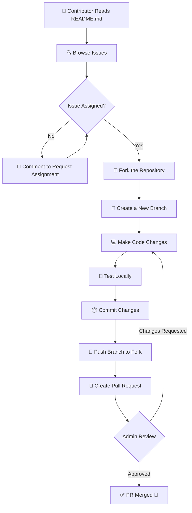

<h1 align="center">🚀 UniFlux </h1>


## 🌐 **AI-Powered Smart University Management & Timetable Optimization Platform**

<div align="center">
  
</div>


<div align="center">
  <br><br>
  <p align="center">
    <b>🎉 This project is now OFFICIALLY accepted for ECWOC 2026</b>
    <br><br>
    <b>🌍 Open Source Program | 🚀 Real Projects | 💡 Real Impact</b>
    <br><br>
    <b>🏆 Elite Coders Winter of Code (ECWOC 2026)</b>
    <br><br>
  </p>
</div>


<div align="center">
  
  <br><br>

  <h3>🧠 What is UniFlux?</h3>

  <p>
    <strong>UniFlux</strong> is a <strong>modern, AI-assisted, open-source web platform</strong> built to 
    <strong>digitally manage, automate, and optimize university academic operations</strong>.
  </p>

  <p>
    The platform focuses on <strong>intelligent timetable generation</strong>, 
    <strong>faculty workload balancing</strong>, and 
    <strong>centralized academic management</strong>—designed specifically for 
    <strong>multi-department, multi-branch universities</strong>.
  </p>

  <p>
    UniFlux replaces <strong>manual scheduling, spreadsheets, and fragmented tools</strong> with a 
    <strong>single unified intelligent system</strong> that is 
    <strong>fast, flexible, scalable</strong>, and fully 
    <strong>aligned with NEP 2020 requirements</strong> 🚀🎓
  </p>
</div>


  <p>
    <strong>UniFlux</strong> is a <strong>modern, AI-assisted, open-source web platform</strong> built to 
    <strong>digitally manage, automate, and optimize university academic operations</strong>.
  </p>

<!---**_Frontend is fully working_**
**_Backend is fully working_**
**_Google Authentication is fully working_** -->

**_🚧 Important Note: Before you start working, check the GitHub repository branch._** <br>
**_🔄 First: Sync (pull) to the latest merged code from the main branch._** <br>
**_✅ Then: Start working on your assigned issue or feature._**


**_⚠ Skipping this step can cause merge conflicts and your PR may be rejected._**

<!---**_🚧 Important Note: login, registration, or Google authentication system Everything is working properly._**-->

**_⚠ Do NOT remove or change any existing code unrelated to your issue! If your PR modifies or deletes any core code without a valid reason, it will not be merged._**

**_🚫 Strict Rule: Do NOT bypass the <!---login, registration, or Google authentication--> system. If any such activity is found, you will be removed and reported from this project._**

---

> ⚠️ **IMPORTANT WARNING:**  
> 💡 **Before pushing your changes, make sure to _switch to the correct branch_ first!** 🪄  
>  
> 🔴 **Commands to Follow:**  
> ```bash
> git checkout <branch-name>    # 🔁 Switch to your assigned branch
> git pull origin <branch-name> # ⬇️ Pull latest updates
> git add .                     # ➕ Add your changes
> git commit -m "your message"  # 💬 Commit with a clear message
> git push origin <branch-name> # 🚀 Push your code safely
> ```
> 🧠 **Tip:** Always double-check the branch before pushing to avoid merge conflicts! ⚡  

---


<h3 📊 Project Insights</h3>

<table align="center">
  <thead align="center">
    <tr>
      <td><b>🌟 Stars</b></td>
      <td><b>🍴 Forks</b></td>
      <td><b>🐛 Issues</b></td>
      <td><b>🔔 Open PRs</b></td>
      <td><b>🔕 Closed PRs</b></td>
      <td><b>🛠️ Languages</b></td>
      <td><b>👥 Contributors</b></td>
      <td><b>📦 Repo Size</b></td>
      <td><b>🕒 Last Commit</b></td>
      <td><b>📈 Commit Activity</b></td>
    </tr>
  </thead>
  <tbody align="center">
    <tr>
      <td>
        
      </td>
      <td>
        
      </td>
      <td>
        
      </td>
      <td>
        
      </td>
      <td>
        
      </td>
      <td>
        
      </td>
      <td>
        
      </td>
      <td>
        
      </td>
      <td>
        
      </td>
      <td>
        
      </td>
    </tr>
  </tbody>
</table>

<hr>


<h2 align="center">🎯 Open Source Programmes ⭐</h2>

🌟 **Big Announcement Ahead!**

### 🏆 Elite Coders Winter of Code (ECWOC 2026)

We’re excited to open the doors to a global community of innovators, learners, and builders for **Elite Coders Winter of Code (ECWOC 2026)** — a flagship open-source initiative focused on **real-world impact, skill acceleration, and collaborative growth** 🚀🌍

ECWOC 2026 brings together **students, developers, designers, and tech enthusiasts** from across India and beyond to work on **production-ready open-source projects**, guided by experienced mentors and driven by a strong culture of learning and contribution 💻✨

This program is designed to go beyond tutorials and theory. Here, contributors gain **hands-on experience**, work on **meaningful problem statements**, and understand how real software is designed, built, reviewed, and shipped in collaborative environments 🧠⚙️

💡 **Why ECWOC 2026?**
Because this is where **code meets purpose**. Participants don’t just write code—they:

* Build scalable, industry-relevant solutions
* Learn best practices in version control, documentation, and clean architecture
* Collaborate in diverse teams across domains and skill levels
* Grow through mentorship, reviews, and continuous feedback

🌈 **What contributors gain**
✨ Exposure to modern tech stacks (Web, AI/ML, Cloud, DevOps & more)
🤝 Open-source collaboration experience on real projects
🧠 Strong foundations in teamwork, leadership, and problem-solving
🎯 Participation in structured milestones, sprints, and reviews
🏆 Recognition, certificates, and program credentials
🌍 Networking with peers, mentors, and open-source leaders

🌍 **Elite Coders Winter of Code is more than a seasonal program.**
It’s a community-driven movement that nurtures talent, encourages knowledge sharing, and empowers contributors to create technology that matters 💫

🎉 Whether you’re taking your **first step into open source** or looking to **mentor and lead**, ECWOC 2026 offers a space to learn, contribute, and grow together.

❤️ We’re excited to welcome you to **Elite Coders Winter of Code 2026** —
where curiosity turns into contribution, and contribution turns into impact.
Let’s build the future, one meaningful commit at a time ❄💻🚀


> ⚠️⚠️ **📢 IMPORTANT NOTICE — PLEASE READ CAREFULLY BEFORE CONTRIBUTING!** ⚠️⚠️  

<details>
  <summary>📘 Click to Read More </summary>

## ✅ **Current Project Status (UniFlux)**

* 🧱 **Project initialized from scratch** with a clean and scalable structure
* 🔐 **Role-based authentication flow planned** (Admin / Department / Faculty)
* 🎨 **Modern UI foundation** using TypeScript & Tailwind CSS
* 🔗 **Clear separation of modules** for easy contribution and scaling

> 🚧 The project is in **active development**. Core features will be built step-by-step through open-source contributions.

---

## ⚠️ **Important Guidelines for Contributors**

### 🔐 **Before You Start**

➡️ Please **read the complete `README.md` carefully** before picking an issue.
➡️ Understand the **project vision, roadmap, and coding standards**.

### 🚫 **Code Safety Rules**

* ❌ Do **not modify or delete existing core code** without discussion
* ❌ Avoid unrelated refactors in your PR
* ❗ PRs that change core logic **without valid justification will not be merged**

---

## 🧭 **How to Contribute Successfully**

* 📌 Pick an issue that matches your skill level
* 💬 Ask questions in the issue or discussion if unsure
* 🧪 Test your changes before submitting a PR
* 📝 Write clear commit messages and PR descriptions

This helps:

* 🚀 Faster PR reviews
* 🔁 Fewer merge conflicts
* 🤝 Better collaboration

---

## 🚨 **Attention Contributors!**

📖 Please make sure you understand:

* 🏛️ What **UniFlux** aims to build
* 🧠 How the **Smart Timetable & University Management system** works
* 🔐 Basic **security & best practices**
* 🤝 Contribution workflow and expectations

🔁 This ensures your contribution fits perfectly into the project vision.

---

## 🎯 **Vision**

To build an **open-source, AI-powered university management platform** that simplifies academic operations, enables smart timetable optimization, balances faculty workload, and supports multidisciplinary education under NEP 2020 — all through a **modern, scalable, and contributor-friendly system**.

---

## 💖 **Community Note**

Let’s build **UniFlux** together —
🎓 smarter universities
⚡ efficient academic systems
🌍 and a welcoming open-source community for everyone.

</details>

<details>
  <summary>📘 Click to Read More </summary>

## 🔄 Contribution Workflow (UniFlux)

### 📌 **Visual Workflow Diagram**

> ✅ You can paste this directly into `README.md` (GitHub supports Mermaid)



---

## 🧭 Contribution Workflow Explained (Simple Steps)

### 👋 **Step 1: Read the README**

📖 Understand:

* Project vision (UniFlux)
* Folder structure
* Coding rules
* Contribution guidelines

---

### 🔍 **Step 2: Pick an Issue**

* Browse open issues
* Choose one based on your skill level:

  * 🟢 Beginner
  * 🟡 Intermediate
  * 🔴 Advanced

---

### 📝 **Step 3: Get the Issue Assigned**

💬 Comment on the issue:

> “I would like to work on this issue.”

⚠️ Do **not** start without assignment.

---

### 🍴 **Step 4: Fork the Repository**

Create your own copy of the UniFlux repository.

---

### 🌿 **Step 5: Create a Branch**

```bash
git checkout -b feature/issue-name
```

---

### 💻 **Step 6: Make Your Changes**

* Follow existing code style
* Do not touch unrelated files
* Keep changes focused on the issue

---

### 🧪 **Step 7: Test Your Code**

✔ Ensure:

* No build errors
* No broken UI
* Feature works as expected

---

### 📦 **Step 8: Commit Your Changes**

```bash
git commit -m "Fix: added timetable UI validation"
```

---

### 🚀 **Step 9: Push to Your Fork**

```bash
git push origin feature/issue-name
```

---

### 🔁 **Step 10: Create a Pull Request**

📝 Include:

* Issue reference
* What you changed
* Screenshots (if UI-related)

---

### 🔍 **Step 11: Review Process**

* Admin reviews PR
* Feedback may be given
* Make changes if requested

---

### ✅ **Step 12: PR Merged 🎉**

Congratulations!
Your contribution is now part of **UniFlux** 🚀🎓

---

## 🚨 Important Rules

* ❌ No direct commits to `main`
* ❌ No unrelated refactors
* ❌ No core logic changes without discussion
* ✅ Clean, focused PRs only

---

## 💖 Final Note

Open-source is about **learning + collaboration**.
Even small contributions matter 💙
  
</details>


<div align="center">
  
</div>


<div align="center">

<h3>👨‍💻 Built with ❤️ by the Dev Elevate Team</h3>

<a href="https://github.com/abhisek2004/Dev-Elevate/issues">Open an Issue</a> | 
<a href="https://youtu.be/zCUTFe8gQEA?si=bS5lkWOxnIuJMXst">Watch Demo</a> | 
<a href="https://develevate-ai.vercel.app">Live</a>

</div>


<div align="right">

🔝 [**Back to Top**](#top)

</div>

<p align="center">
  
</p>


